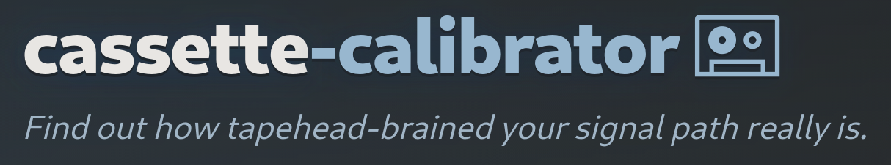

# cassette-calibrator

A CLI-first cassette measurement/calibration tool with an optional local WebUI. It is designed for testing a compact cassette recording/playback chain with generated reference audio, automated marker detection, drift compensation, and response analysis.

The same workflow also works for plenty of other signal-chain measurements outside cassette use, but cassettes are the main target.

It generates a cassette-friendly test WAV with configurable DTMF markers, then analyzes a recorded playback capture to estimate magnitude response, optional loopback-subtracted difference response, and SNR.

The WebUI now also supports saved-run browsing, run regeneration from stored source WAV paths, configurable locked y-axis plotting for analysis/regen/compare, compare-grid rendering, editable run notes, and optional filesystem restriction to a configured WebUI root.

## What this does

- Generates a print-to-tape WAV containing:
  - DTMF start marker (audio timecode anchor)
  - Dedicated silence window for noise-floor measurement
  - DTMF countdown (default on; mostly for humans, alignment uses start/end markers)
  - 1 kHz reference tone for setting record level
  - ESS log sweep (default 20 Hz -> 20 kHz)
  - Optional periodic DTMF "ticks" embedded during the sweep (for non-linear drift correction)
  - DTMF end marker

- Analyzes a recorded capture by:
  - Detecting start/end markers automatically (no manual alignment)
  - Extracting the sweep region based on known layout
  - Applying a linear time-warp based on marker-to-marker drift (transport speed mismatch)
  - Optional tick-based piecewise time-warp (handles non-linear wow/flutter better than a single linear warp)
  - Optional fine alignment via correlation
  - ESS deconvolution -> impulse response -> magnitude response
  - Exporting plots + CSV + summary JSON
  - Estimating SNR from the dedicated silence window vs the mid-tone RMS

## Install

Python 3.9+ recommended. Tested on Python 3.12.x.

```bash
python3 -m pip install -r requirements.txt
```

Notes:

* `soundfile` is currently listed in `requirements.txt` (optional / future-proofing for better audio I/O).
* If you want minimal deps, remove `soundfile` from `requirements.txt` unless you actually use it in code.

## Local WebUI (optional)

A local-only, stdlib-only WebUI is included as `webui.py`. It supports generation, marker detection, analysis, saved-run browsing, note editing, regeneration, compare-grid rendering, WAV upload, and optional restricted-root filesystem access. It calls into the same `cassette_calibrator.py` command handlers and uses your `cassette_calibrator.toml` defaults.

Launch:

```bash
python3 webui.py
# options:
# python3 webui.py --host 127.0.0.1 --port 8765
# python3 webui.py --no-browser
```

Config (optional) via `cassette_calibrator.toml`:

```toml
[webui]
host = "127.0.0.1"
port = 8765
open_browser = true

# Optional: reverse-proxy/subdirectory hosting
url_prefix = ""

# Optional: when true, older runs without explicit stored plot settings
# can fall back to current config values for plot lock/min/max.
legacy_run_plot_fallback_from_config = true

# Optional: restrict the WebUI filesystem browser / file serving / writes
# to a specific project subdirectory instead of the whole project root.
restrict_to_root_dir = false
allow_project_root_access = true
root_dir = "data"
```

### WebUI features

* Run `gen`, `detect`, and `analyze` with the same defaults you use from CLI / TOML
* Browse files safely using relative paths only
* Upload WAV files into the allowed project area from the browser
* Create output directories from the browser
* Browse prior runs by scanning for `summary.json`
* View plots/images referenced in `summary.json`
* **Edit run notes for an existing run** without re-running analysis
* **Regenerate a saved run** from the original stored source WAV paths
* **Reuse saved effective analysis settings for regeneration**, including stored replay payloads
* **Lock response plot y-axis** in analysis, regeneration, and compare rendering
* Render compare grids across multiple saved runs
* Optionally restrict WebUI browsing / file serving / writes to a configured subdirectory instead of the whole project root

### Editing run notes (WebUI)

When you load a run under the "runs" card, you can click **Edit notes** to change the run notes stored in that run's `summary.json`.

Behavior:

* Saves to `<run-dir>/summary.json` under `run.notes`
* Clearing notes (blank) removes `run.notes`
* Uses an atomic write (temp file + replace)
* Preserves `mtime` so the run list ordering does not change just because notes were edited

### Regenerating saved runs (WebUI)

The WebUI can regenerate a previously saved run by reading that run's `summary.json` and reusing the saved source WAV paths.

Behavior:

* Reads the original reference / recorded WAV paths from the saved run metadata
* Creates a new run instead of overwriting the old one
* Appends `-- regen` to the run name
* Appends a regeneration note with source run path + timestamp
* Preserves locked y-axis choices made in the regeneration UI
* Reuses the saved effective replay payload when available, so regeneration follows the original analysis settings much more closely
* Older runs without stored replay payloads fall back to legacy summary-based reconstruction

Important:

* Regeneration only works if the original source WAV files still exist under the allowed project area
* The regenerated run writes a fresh `summary.json` and records which run it was regenerated from

## Path rules (important)

**Important:** the WebUI only accepts **relative paths under the allowed project area**. No absolute paths, and no `..`.

If you paste `/home/you/recorded.wav`, you'll get:

`ERROR: path must be relative (no absolute paths, no '..')`

Fix: put the file under the repo (recommended `data/`) and use `data/recorded.wav`, or use the Browse button which returns safe relative paths.

### WebUI root restriction

By default, the WebUI operates under the project root.

Optionally, you can restrict it to a configured subdirectory using:

```toml
[webui]
restrict_to_root_dir = true
allow_project_root_access = false
root_dir = "data"
```

When restricted, the WebUI browser / file serving / uploads / directory creation / output paths are confined to that configured root.

Security posture:

* Binds to `127.0.0.1` by default
* Rejects absolute paths and any `..` traversal
* Only serves/browses files under the allowed WebUI root
* Can write only within the allowed WebUI root
* The browser "Up" navigation stops cleanly at the allowed root instead of wandering higher

## Workflow

### 1) Generate the test WAV

```bash
python3 cassette_calibrator.py gen --out sweepcass.wav
# disable countdown if you want:
# python3 cassette_calibrator.py gen --out sweepcass.wav --no-countdown
```

Recommended cassette-friendly settings (more buffer for sloppy transport + better noise measurement):

```bash
python3 cassette_calibrator.py gen --out sweepcass.wav --pre-s 3 --noisewin-s 2
```

### 2) Print to tape and capture playback

**Before you start (quick sanity):**

* Clean heads + capstan + pinch roller.
* Set the deck’s tape type correctly (Type I/II/IV).
* Disable anything "helpful" in the chain: Dolby/NR, EQ, AGC, enhancers, expander, etc. (deck + interface mixer + OS).

**A) Record pass (interface -> deck -> tape)**

* Connect **interface line out** (L/R) -> deck **line in / aux in** (do **not** use mic inputs).
* Play `sweepcass.wav` from a player that doesn’t resample or add DSP.

  * Avoid OS "audio enhancements" at all costs! Disable **all** spatial sound, EQ, loudness normalization and other audio enhancements from your audio host device.
  * Don’t let system sounds mix into the output.
* Start deck recording, then start playback of `sweepcass.wav` from the beginning.
* When the file reaches the **1 kHz reference tone**, set the deck’s record level:

  * Aim for a safe, repeatable level (avoid clipping/redlining).
  * The goal is consistency, not "as hot as possible".
* Rewind and do a clean, uninterrupted record pass of the full file (including pre/post silence).

**B) Playback capture (deck -> interface -> WAV)**

* Connect deck **line out / rec out** -> **interface line in**.
* Capture as `recorded.wav` at the **same sample rate** as generated (default 44.1 kHz).
* Record at **24-bit** if you can; leave headroom (avoid clipping).
* Start recording first, then start cassette playback; stop after the end marker + post silence.

Avoid any AGC/NR/enhancers in the interface path.

### 3) (Optional) sanity-check marker detection

```bash
python3 cassette_calibrator.py detect --wav recorded.wav
# or machine-readable:
python3 cassette_calibrator.py detect --wav recorded.wav --json
```

### 4) Analyze and export results

For stereo:

```bash
python3 cassette_calibrator.py analyze --ref sweepcass.wav --rec recorded.wav --outdir results --fine-align --channels stereo
# or print summary JSON:
python3 cassette_calibrator.py analyze --ref sweepcass.wav --rec recorded.wav --outdir results --fine-align --channels stereo --json
```

For mono:

```bash
python3 cassette_calibrator.py analyze --ref sweepcass.wav --rec recorded.wav --outdir results --fine-align --channels mono
```

Run name/notes:

* You can set a run name and run notes via CLI flags (see `python3 cassette_calibrator.py analyze --help`) and/or via the WebUI.
* WebUI can also edit notes later for an existing run by updating that run's `summary.json`.

WebUI note:

* Saved runs can later be regenerated from the WebUI.
* Regeneration creates a new run and reuses the stored source WAV paths plus the saved effective replay payload when available.
* This is especially useful after changing plot lock/min/max or when re-checking old runs without manually rebuilding the full command line.

### 4b) Optional: ticks mode (non-linear drift correction)

Cassette transports can drift non-linearly (wow/flutter). The default method uses a single linear warp based on the start/end markers, which corrects overall speed mismatch but can't fully fix curvature within the sweep.

Ticks mode embeds short periodic DTMF symbols inside the sweep, then uses them to build a piecewise time warp. Use it if you see "wavy" response curves or inconsistent alignment between runs.

Generate with ticks:

```bash
python3 cassette_calibrator.py gen --out sweepcass.wav --ticks
```

Analyze with ticks:

```bash
python3 cassette_calibrator.py analyze --ref sweepcass.wav --rec recorded.wav --outdir results --ticks
```

If tick matching fails (falls back to linear warp), try:

* raise tick level at generation: `--tick-dbfs -16` (or louder)
* loosen detection: `--thresh 5.0` or `--min-dbfs -60`
* widen matching tolerance: `--tick-match-tol-s 0.5`

### 5) Optional: subtract interface coloration with a loopback capture

Make a loopback capture by patching interface line out -> line in (no cassette), while playing `sweepcass.wav`.

```bash
python3 cassette_calibrator.py analyze \
  --ref sweepcass.wav \
  --rec recorded.wav \
  --loopback loopback.wav \
  --outdir results \
  --fine-align
```

This produces `difference.png` ("cassette chain minus loopback").

## Outputs

In `--outdir`:

* If analyzing **mono** (`--channels mono`):

  * `response.png` -- smoothed magnitude response (log frequency)
  * `response.csv` -- raw + smoothed response data
  * `summary.json` -- marker times, drift ratio, SNR estimate, settings used (plus optional run name/notes metadata)
  * `difference.png` -- only if `--loopback` is provided
  * `impulse.png` -- only if `--save-ir` is used

* If analyzing **stereo** (default, `--channels stereo`):

  * `response_l.png`, `response_r.png`
  * `response_l.csv`, `response_r.csv`
  * `summary.json` (includes optional run name/notes metadata)
  * `response_lr_overlay.png` -- L/R overlay plot (smoothed)
  * `lr_diff.png` -- L minus R mismatch (smoothed)
  * `difference_l.png`, `difference_r.png` -- only if `--loopback` is provided
  * `impulse_l.png`, `impulse_r.png` -- only if `--save-ir` is used

## Notes and gotchas

* HF loss is often mechanical (azimuth, head wear, dirty path, wrong tape-type EQ) before it's "EQ fixing".
* Cassette transports drift. This tool compensates drift with a linear warp between start/end markers.
* For non-linear drift (wow/flutter), enable ticks mode (`gen --ticks` + `analyze --ticks`) for piecewise correction.
* If marker detection fails:
  * Generate hotter markers: `--marker-dbfs -10`
  * Loosen detection: lower `--thresh` (e.g. 4.5) or set `--min-dbfs -60`
* Before measuring: clean heads/capstan/pinch roller; check azimuth if HF looks nuked.
* Set record level using the 1 kHz reference tone (avoid clipping / redlining).
* Keep any NR / enhancers off unless you are specifically measuring them.
* WebUI paths are **relative to the project root**. Put files under `data/` and browse/pick them.
* Locked y-axis plotting is useful when comparing runs; otherwise autoscaling can make two bad runs look deceptively similar.
* Regeneration of old runs depends on the original reference / recorded WAV files still being present.
* Older runs that predate stored replay payload support may regenerate with a best-effort legacy fallback instead of a perfect reproduction of the original analysis invocation.
* WebUI filesystem access can be restricted to a configured subdirectory; when enabled, paths outside that root are rejected.

## TODO / WIP

* A/B spectrogram view: one horizontal spectrogram for the reference "input" WAV and one for the synced recorded capture -- with optional L/R split if the files are stereo.

* Comparative spectrum analyzer / visualizer: timeline + playhead, with color-coded overlay (baseline vs cassette-looped) so you can see how they interact/differ over time.

* Phase correlation check (correlation meter / phase relationship), ideally also available per-channel.

## Changelog / History

* 0.3.1 - Safer WebUI output naming and overwrite handling for generated test WAVs

  * [webui] Added `propose_timestamped_test_audio_default` (default: `true`) so the generation form suggests a timestamped output filename by default instead of reusing a fixed `data/test_audio.wav` path.
  * [webui] Timestamped test WAV suggestions are generated from the browser's local time to reduce accidental overwrite of older reference files.
  * [webui] Kept CLI / TOML `[gen].out` behavior intact; the timestamped naming change is WebUI-only.
  * [webui] Added overwrite warning handling for generated test WAV output paths when the selected target file already exists.
  * [webui] Added an overwrite confirmation dialog with `Overwrite`, `Auto-rename`, and `Cancel` options before replacing an existing generated test WAV.
  * [webui] Added `[webui].warn_on_overwrite` (default: `true`) to control whether the WebUI asks for overwrite confirmation before replacing an existing generated test WAV.

* 0.3.0 - WebUI run regeneration, locked y-axis workflow, and stricter root/path handling

  * [webui] Added saved-run regeneration from `summary.json`, creating a new run from the original stored source WAV paths instead of forcing manual re-entry.
  * [webui] Regenerated runs now append `-- regen` to the run name and add a regeneration note with source run path + timestamp.
  * [webui] Added persistent replay-payload storage in `summary.json` so regeneration can reuse the original effective analysis settings much more faithfully.
  * [webui] Fixed regeneration to reuse the actual successful effective analysis args, not just the incoming minimal WebUI override payload.
  * [webui] Preserved and exposed locked y-axis controls across main analysis, saved-run regeneration, and compare-grid rendering.
  * [webui] Added per-run plot config fallback handling for older runs via `_summary_plot_cfg()` and config-driven defaults.
  * [webui] Improved compare rendering so locked y-axis behavior is explicit and consistent when rendering shared-axis compare plots.
  * [webui] Hardened optional WebUI root restriction behavior:
    * configurable restricted root under `[webui]`
    * cleaner enforcement of allowed-root traversal limits
    * browser "Up" navigation stops at the allowed root
    * uploads, browsing, file serving, and directory creation stay within the allowed root
  * [webui] Clarified allowed-root state in the browser UI and tightened path-handling behavior for restricted deployments.
  * [webui] Generalized the WebUI into a more coherent saved-run workflow: browse -> inspect -> edit notes -> regenerate -> compare.

* 0.2.7 - WebUI defaults cleanup + optional spoken voice cues

  * Added optional spoken voice cues for the generated test audio (`begin test` / `end test`) for human/operator reference.
  * Added `voice_cues.py` and the `voicecues` command for generating reusable cue WAVs into `data/voice_cues`.
  * Added `gen` support for spoken cue insertion, including cue directory, cue padding, cue level, auto-generation, and forced regeneration options.
  * [webui] Fixed backend form/default fallback handling so WebUI no longer hardcodes legacy fallback paths like `data/sweepcass.wav` and `data/cassette_results` when command defaults are already available from the real CLI parser.
  * [webui] `_build_form_defaults()` now starts from actual argparse defaults and then applies TOML config overrides, keeping WebUI defaults aligned with the CLI instead of maintaining a separate fallback layer.
  * [webui] WebUI generation/analyze default paths now follow `cassette_calibrator.toml` and parser defaults more cleanly, including `[gen].out` and `[analyze].outdir`.
  * [webui] Kept `.env`-based WebUI overrides intact for host/port/browser/url-prefix handling.
  * [webui] Preserved URL prefix support and prefixed browser-open behavior while cleaning up config/default precedence.

* 0.2.6 - WebUI generation summary + summary/status polish

  * [webui] Added a human-readable generation summary under the Step 1 test WAV output.
  * [webui] Generation summary now shows parsed core details more cleanly, including output path, sample rate, duration, peak, marker strings, noise window, tone, and sweep settings.
  * [webui] Added clearer success / warning / fail summary panels for generation and detection results.
  * [webui] Fixed and cleaned up summary-panel CSS so the status boxes render consistently instead of using broken/garbled rules.
  * [webui] Hardened frontend HTML escaping for rendered text fields to avoid busted output from unsafe characters.
  * [webui] Updated the WebUI HTTP server version string to follow the actual app version dynamically.

* 0.2.5 - WebUI detect summary + env override polish

  * [webui] Added a human-readable detection summary under the Step 2 marker-detection output.
  * [webui] Kept the raw JSON / "terminal-like" detect output intact for technical inspection.
  * [webui] Added clear visual detection status reporting:
    * green OK when both start and end markers are found
    * warning/fail states when one or both markers are missing
  * [webui] Detection summary now shows key parsed values in a more readable form, including WAV path, sample rate, channel, marker patterns, marker times, DTMF event count, and final pass/fail status.
  * [webui] Added `.env` support for overriding browser auto-open behavior via `WEBUI_OPEN_BROWSER`.
  * [webui] Added safer bool parsing for browser auto-open configuration (`true/false`, `yes/no`, `on/off`, `1/0`).

* 0.2.4 - WebUI footer + startup output polish

  * Added a proper WebUI footer with project / author attribution.
  * Linked the copyright notice to the FlyingFathead GitHub profile.
  * Polished startup console output with clearer URL/prefix messaging and terminal-width separators.
  * Minor cleanup for safer numeric coercion in WebUI request handling.

* 0.2.3 - WebUI URL prefix support + startup/output polish

  * Added proper WebUI URL prefix support for reverse-proxy/subdirectory hosting (for example `/cassette`).
  * WebUI routes now handle prefixed requests cleanly while still allowing direct local access without the prefix.
  * Browser-open behavior now uses the actual prefixed WebUI URL when a custom prefix is configured.
  * Improved startup output so prefixed deployments report both the bind/listen address and the real WebUI URL more clearly.
  * Added cleaner terminal startup banner/separator output around the WebUI startup message.
  * Tightened float coercion/parsing so invalid/non-finite numeric values are ignored more safely instead of leaking bad values into overrides.
  * Cleaned up backend import/bootstrap ordering around the headless matplotlib setup for safer WebUI startup behavior.

* 0.2.2 - WebUI SVG logo + static asset serving polish

  * Added a new SVG cassette logo/mark for the WebUI header.
  * The WebUI now serves local static assets from `/assets/...`, so bundled logo files load correctly in the browser.
  * Added proper SVG content-type handling (`image/svg+xml`) in the stdlib WebUI server.
  * Tweaked header/logo presentation so the SVG mark no longer inherits the generic analysis-image border/radius styling.
  * Increased and cleaned up the header logo sizing/alignment so the new cassette mark reads properly as part of the branding instead of a tiny side garnish.

* 0.2.1 - README logo + cleaner WebUI startup bind errors

  * Added project logo image to the README for cleaner repo presentation.
  * Improved WebUI startup error handling when the bind fails.
  * Common startup cases like "address already in use" now exit cleanly with actionable guidance instead of dumping a full traceback.
  * Clarified likely causes for bind failures:
    * another `cassette-calibrator` WebUI instance is already running
    * another program is already using the configured port
  * Added clearer recovery guidance:
    * stop the conflicting process
    * start the WebUI on another port with `--port`
    * or change `[webui].port` in `cassette_calibrator.toml`

* 0.2.0 - Core cleanup, WebUI file transfer support, analysis fixes, and broader WebUI polish

  * Cleaned up duplicate/overlapping logic in `cassette_calibrator.py` so the core analysis/detection path is less brittle and easier to maintain.
  * Added **WebUI file upload + download support**:
    * Upload WAVs directly from the browser into the project tree
    * Download generated files/results back from the browser
    * Safe filename handling + validation for uploaded WAVs
  * Improved WebUI run/result handling:
    * Previous runs are now populated into the UI without needing a manual refresh after page load
    * Run/result lists can be refreshed from the UI after new work is created
    * New analysis runs refresh the available run lists in the frontend
  * Fixed analysis-side issues/bugs in the cassette measurement flow that affected reliability/usability.
  * More WebUI bugfixes and general polish across browsing, result viewing, and run management.

* 0.1.9 - WebUI: compare grids + TOML-driven DTMF presets; better plot ticks
  * Added **Compare** workflow in WebUI: pick multiple runs, reorder columns, choose metric + channels, and render a **single high-res grid PNG** (shared axes when CSV data exists).
  * Compare plots now use **audio-friendly frequency ticks/labels** (no more scientific-notation x-axis like 2e4 / 1e3).
  * WebUI DTMF/marker presets are now **built from `cassette_calibrator.toml`** (`[detect]` + `[presets.<name>.detect]`) and exposed in the UI.
  * Added **auto-tune ladder** for marker detection on analyze failure (relaxes `min_dbfs` / `thresh` progressively).
  * Misc WebUI polish: safer browsing/dir creation + small endpoint additions used by UI features.

* 0.1.8 - WebUI enhancements
  * Enhanced logging, errors/status
  * Matplotlib output plots are now named with a title set as the run name
  * Plenty of bugfixes

* 0.1.7 - WebUI: clickable images + fullscreen viewer

  * Thumbnails are now clickable: opens a fullscreen overlay viewer for easier inspection/zooming.
  * Added "Open in new tab" link per image so you can view the raw PNG directly (browser zoom works properly).
  * Added fit/actual-size toggle controls (plus keyboard ESC to close).
  * Added lightweight file stat endpoint used by the viewer to display image metadata.

* 0.1.6 - WebUI: edit notes for existing runs

  * Added "Edit notes" UI for loaded runs with Save/Cancel.
  * Added `/api/run_notes` endpoint to update `summary.json` -> `run.notes` for a run directory.
  * Atomic JSON write with mtime preservation so run list ordering does not change due to note edits.
  * README updated to document the notes editor and write behavior.

* 0.1.5 - Stereo outputs + tick-warp improvements; README/output docs sync
  * Added stereo analysis outputs: per-channel plots/CSVs (`response_l/r.*`) plus `lr_diff.png`.
  * Added optional L/R overlay plot output: `response_lr_overlay.png` (enabled by default when analyzing both L and R).
  * Added tick-based non-linear drift correction ("ticks mode") with matching/tolerance controls and a quality gate to avoid bad warps.
  * Improved DTMF detection stability: safer/auto dedupe behavior and optional timing stats logging (`--dtmf-stats`).
  * Config/TOML support expanded for new options (channels, marker_channel, overlay toggles/colors, tick settings, SNR section mapping).
  * WebUI now surfaces the new stereo outputs/overlay images from `summary.json`.
  * Documentation updated to reflect stereo-default outputs and filenames.

* 0.1.4 - Local WebUI (stdlib) introduced; fixes

  * Added `webui.py` local-only WebUI (binds to 127.0.0.1 by default).
  * Modal file browser with directory creation and safe relative-path handling.
  * Fixed onclick/quoting issues in generated browse list buttons.
  * Documents relative-path requirement (no absolute paths / no "..").

* 0.1.3 - x-axis plot style; drift alignment fixes and more

  * Improved plot x-axis formatting/ticks for audio frequencies (20 Hz–20 kHz readability).
  * Drift alignment fixes for more reliable marker-to-marker speed compensation.
  * Better exports/plot naming consistency (response plots + CSV + summary JSON).

* 0.1.2 - bugfixes; config changes; dedupe parsing
* 0.1.1 - Patches to `--help` etc
* 0.1.0 - Initial release

## About

By [FlyingFathead](https://github.com/FlyingFathead) with bits and bytes of help from ChaosWhisperer.
